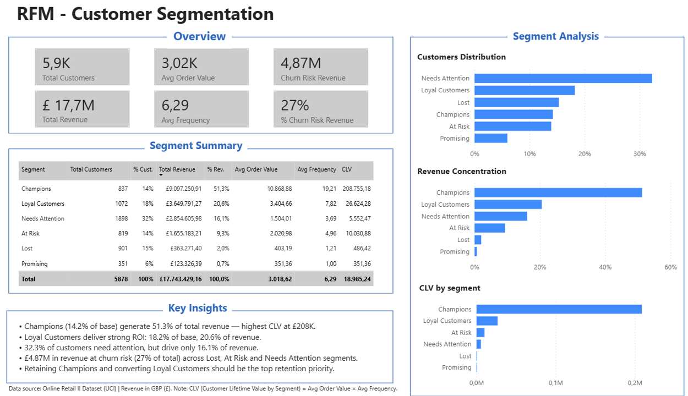

# RFM Customer Segmentation Analysis


## Overview
This project applies RFM (Recency, Frequency, Monetary) methodology to segment 5,900+ customers of a UK-based e-commerce company, identifying behavioral patterns to support targeted marketing and retention strategies.

## Business Problem
The company needed to understand which customers drive the most revenue, which are at risk of churning, and which represent growth opportunities — enabling data-driven prioritization of marketing efforts.

## Dataset
- **Source:** Online Retail II dataset (UCI Machine Learning Repository)
- **Period:** December 2009 – December 2011
- **Volume:** 1,067,371 transactions | 5,942 unique customers
- **Tool:** Google BigQuery (SQL)

## Tools & Technologies
- **SQL:** Google BigQuery
- **Visualization:** Power BI (DAX measures)
- **Methodology:** RFM Segmentation, Window Functions, CTEs

## Methodology

### Data Quality Assessment
Before analysis, key data issues were identified and addressed:
- 243,007 rows excluded due to missing Customer ID (guest purchases)
- Negative quantities removed (returns/negative quantities)
- 4,307 rows removed (zero price)

### RFM Scoring
Each customer was scored 1–3 on three dimensions:
- **Recency:** Days since last purchase (lower = better)
- **Frequency:** Number of unique orders
- **Monetary:** Total revenue generated

Scores were assigned using `NTILE(3)` window function for equal distribution.

### Customer Segments
| Segment | Customers | Total Revenue | Avg. Monetary |
|---|---|---|---|
| Champions | 837 | £9,097,250 | £10,868 |
| Loyal Customers | 1,072 | £3,649,791 | £3,404 |
| Needs Attention | 1,898 | £2,854,605 | £1,504 |
| At Risk | 819 | £1,655,183 | £2,020 |
| Lost | 901 | £363,271 | £403 |
| Promising | 351 | £123,326 | £351 |

## Key Findings
- **Champions** (14.2% of customers) generate **51.3% of total revenue** — highest CLV at £208K
- **£4.87M in revenue at churn risk** (27% of total) across Lost, At Risk and Needs Attention segments
- **Loyal Customers** deliver strong ROI: 18.2% of base, 20.6% of revenue
- Retaining Champions and converting Loyal Customers should be the top retention priority

## Business Recommendations
| Segment | Recommended Action |
|---|---|
| Champions | Loyalty rewards, early access to new products |
| Loyal Customers | Upselling, referral programs |
| Needs Attention | Re-engagement emails, personalized offers |
| At Risk | Win-back campaigns with incentives |
| Lost | Low-cost reactivation or deprioritize |
| Promising | Onboarding sequences, first purchase incentives |

## SQL Query

```sql
-- ============================================
-- RFM Customer Segmentation Analysis
-- Dataset: Online Retail II (UCI)
-- Tool: Google BigQuery
-- ============================================

-- Step 1: Data Cleaning
WITH cleaned_data AS (
  SELECT
    CustomerID,
    InvoiceDate,
    Quantity,
    Price,
    Quantity * Price AS revenue
  FROM `rfm-analysis-portfolio.rfm_analysis.online_retail`
  WHERE
    CustomerID IS NOT NULL
    AND Quantity > 0
    AND Price > 0
),

-- Step 2: RFM Metrics per customer
rfm_metrics AS (
  SELECT
    CustomerID,
    DATE_DIFF(DATE '2011-12-31', MAX(DATE(InvoiceDate)), DAY) AS recency,
    COUNT(DISTINCT Invoice)                                    AS frequency,
    ROUND(SUM(revenue), 2)                                     AS monetary
  FROM cleaned_data
  GROUP BY CustomerID
),

-- Step 3: RFM Scoring (1-3) using NTILE
rfm_scores AS (
  SELECT
    CustomerID,
    recency,
    frequency,
    monetary,
    NTILE(3) OVER (ORDER BY recency DESC)   AS r_score,
    NTILE(3) OVER (ORDER BY frequency ASC)  AS f_score,
    NTILE(3) OVER (ORDER BY monetary ASC)   AS m_score
  FROM rfm_metrics
),

-- Step 4: Segment assignment
rfm_segments AS (
  SELECT
    CustomerID,
    recency,
    frequency,
    monetary,
    r_score,
    f_score,
    m_score,
    CONCAT(CAST(r_score AS STRING),
           CAST(f_score AS STRING),
           CAST(m_score AS STRING)) AS rfm_code,
    CASE
      WHEN r_score = 3 AND f_score = 3 AND m_score = 3 THEN 'Champions'
      WHEN f_score = 3 AND m_score = 3                 THEN 'Loyal Customers'
      WHEN r_score = 3 AND f_score = 1                 THEN 'Promising'
      WHEN r_score = 2 AND f_score >= 2                THEN 'Needs Attention'
      WHEN r_score = 1 AND f_score >= 2                THEN 'At Risk'
      ELSE 'Lost'
    END AS segment
  FROM rfm_scores
)

-- Step 5: Final output
SELECT * FROM rfm_segments
ORDER BY monetary DESC;
```

---
*Data source: Online Retail II Dataset (UCI Machine Learning Repository) | Revenue in GBP (£)*
